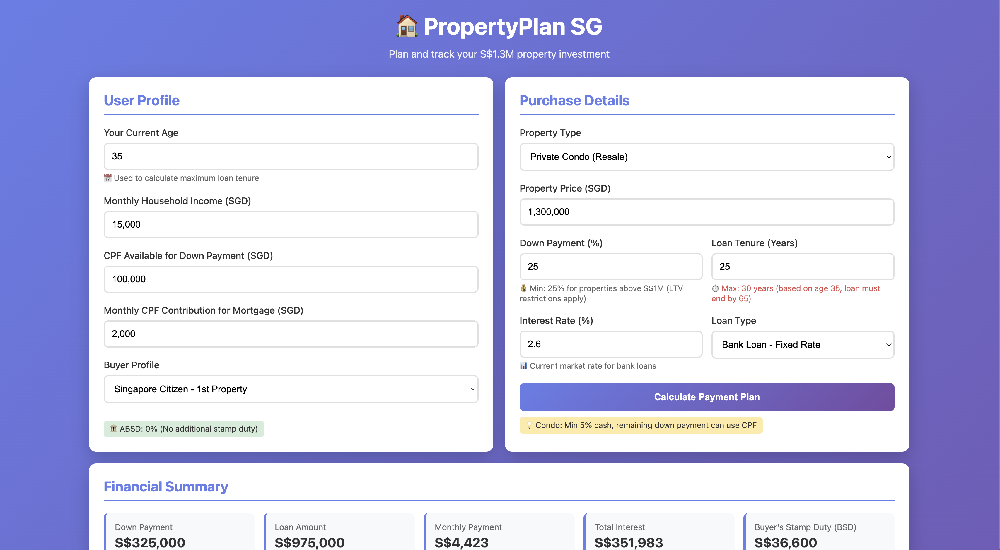

# 🏠 PropertyPlan SG

An interactive Singapore property purchase calculator that helps you analyze HDB and private condo financing, including stamp duties (BSD/ABSD), loan calculations, and scenario comparisons.



🔗 **Live Demo:** [https://vasanttan.github.io/propertyplan-sg/](https://vasanttan.github.io/propertyplan-sg/)

---

## ✨ Features

### 💰 Comprehensive Financial Analysis
- **Property Types**: HDB and Private Condo support
- **Down Payment Calculator**: Automatic minimum requirement validation
- **Loan Calculations**: Monthly payments, total interest, payment schedules
- **Stamp Duty**: Buyer's Stamp Duty (BSD) and Additional Buyer's Stamp Duty (ABSD)
- **TDSR Validation**: Total Debt Servicing Ratio checks
- **CPF Usage**: Track CPF Ordinary Account utilization
- **Age-Based Restrictions**: Automatic loan tenure limits (loan must end by age 65)

### 🆕 Scenario Comparison System (New!)
- **Save Unlimited Scenarios**: Store different property configurations for comparison
- **Side-by-Side Analysis**: Compare 2-10 scenarios simultaneously
- **Dual View Modes**:
  - **Classic View** 🎴: Visual card-based comparison with Best Value badges
  - **Compact View** 📋: Detailed table for metric-by-metric analysis
- **Smart Highlights**: Trophy indicators (🏆) automatically mark best values:
  - Lowest monthly payment
  - Lowest down payment
  - Lowest total interest
  - Lowest total cash needed
  - Lowest TDSR ratio
  - Lowest total payment (price + interest)
- **CSV Export**: Download comparison data for Excel/Sheets analysis
- **Persistent Storage**: Scenarios saved in browser localStorage

### 📊 Interactive Visualizations
- **Payment Schedule Table**: Monthly breakdown of principal vs. interest
- **Cumulative Chart**: Visual representation of payment over time (Chart.js)
- **Export to CSV**: Download payment schedules for external analysis

### 🎯 Smart Validation
- **Real-time Updates**: Loan tenure validation updates instantly with age/property changes
- **Visual Feedback**: Red text warnings when age limits loan options
- **Decimal Prevention**: Auto-corrects non-integer values (e.g., 30.5 years → 30 years)
- **Custom Modals**: Sandboxed-environment compatible dialogs

### 🎨 User Experience
- **Single-File Application**: No installation or backend required
- **Mobile Responsive**: Works on all devices
- **Dark Mode Ready**: Clean purple gradient design
- **Standardized UI**: Consistent button colors and hover effects throughout

---

## 🚀 Quick Start

### Use Online
Simply visit: [https://vasanttan.github.io/propertyplan-sg/](https://vasanttan.github.io/propertyplan-sg/)

### Use Offline
1. Download `index.html`
2. Open in any modern browser (Chrome, Firefox, Safari, Edge)
3. No installation needed!

---

## 📖 How to Use

### Basic Calculation
1. **Enter Your Profile**
   - Age (affects maximum loan tenure)
   - Monthly household income
   - CPF available and monthly contributions
   - Buyer profile (SC 1st property, PR, Foreigner, etc.)

2. **Enter Property Details**
   - Property type (HDB or Condo)
   - Property price
   - Down payment percentage (minimum 25% for resale condo)
   - Loan tenure (max 30 years or until age 65)
   - Interest rate (HDB: 2.6%, Bank: typically 2.6-3.5%)

3. **Review Results**
   - Monthly payment and TDSR ratio
   - Stamp duties (BSD + ABSD)
   - Total cash needed upfront
   - Payment schedule and cumulative chart

### Scenario Comparison
1. **Save First Scenario**
   - Fill in details for your first option
   - Click "Calculate Payment Plan"
   - Click "💾 Save Scenario"
   - Name it (e.g., "25% Down - 25 Years")

2. **Save More Scenarios**
   - Adjust parameters (try 30% down payment, or 20-year loan)
   - Calculate and save each variation
   - Save as many as you want!

3. **Compare Side-by-Side**
   - Click "📊 Compare Scenarios"
   - Select which scenarios to compare (2-10)
   - Toggle between Classic 🎴 or Compact 📋 view
   - Trophy indicators (🏆) show best values
   - Export to CSV for deeper analysis

### Example Comparisons
- **Down Payment Strategy**: 25% vs 30% vs 35%
- **Loan Tenure**: 20 years vs 25 years vs 30 years
- **Property Options**: Different properties at different price points
- **Interest Rates**: Fixed vs Floating rate comparison

---

## 💡 Use Cases

### 1. First-Time Buyers
"Should I buy HDB or Condo? What can I afford?"
- Compare HDB ($500K) vs Condo ($1.2M)
- See actual monthly payments and cash needed
- Understand ABSD implications

### 2. Down Payment Planning
"Is it better to put 25% or 30% down?"
- Compare scenarios with different down payments
- See trade-off: lower monthly payment vs more cash upfront
- Calculate total interest savings

### 3. Loan Tenure Strategy
"Should I take a 20-year or 30-year loan?"
- Compare different loan tenures
- Shorter = higher monthly payment but less total interest
- Longer = lower monthly payment but more total interest

### 4. Upgrading Decisions
"Can I afford to upgrade from HDB to Condo?"
- Model current HDB and target Condo
- Factor in ABSD for 2nd property
- See if TDSR limits approve your plan

### 5. Age Impact Analysis
"I'm 40 years old - how does this limit my loan?"
- See automatic tenure restrictions (max 25 years)
- Compare with younger buyer scenarios
- Plan refinancing strategies

---

## 🏆 What Makes PropertyPlan SG Special?

### Singapore-Specific Calculations
- **BSD**: 2024 progressive rates (up to $1.5M+)
- **ABSD**: Accurate rates for SC/PR/Foreigner, 1st/2nd/3rd properties
- **TDSR**: 55% limit validation
- **CPF Rules**: OA usage for down payment and monthly
- **HDB Loans**: 2.6% concessionary rate
- **Age Limits**: Loan must end by 65

### Comparison That Matters
Unlike simple calculators, PropertyPlan SG lets you:
- Save unlimited scenarios
- Compare them side-by-side
- See which option wins each metric
- Export data for further analysis
- Share comparisons with family/advisors

### No Backend Required
- Everything runs in your browser
- No data sent to servers
- Completely private
- Works offline after first load
- No signup or login needed

---

## 🛠️ Technical Details

### Built With
- **HTML5**: Single-file architecture
- **CSS3**: Purple gradient design, responsive layout
- **Vanilla JavaScript**: No frameworks, lightweight
- **Chart.js**: Interactive payment visualizations
- **localStorage**: Persistent scenario storage

### Browser Compatibility
- ✅ Chrome 90+
- ✅ Firefox 88+
- ✅ Safari 14+
- ✅ Edge 90+
- ✅ Mobile browsers (iOS Safari, Chrome Mobile)

### File Size
- Single HTML file: ~103 KB
- With Chart.js CDN: ~200 KB total
- Loads in < 1 second

---

## 📸 Screenshots

### Main Calculator


### Scenario Comparison


### Payment Schedule


---

## 🗺️ Roadmap

### Planned Features
- [ ] Rental yield calculator
- [ ] Property appreciation estimator
- [ ] Refinancing comparison tool
- [ ] Monthly expense tracker integration
- [ ] PDF report export
- [ ] Share comparison via URL

### Ideas Welcome!
Have suggestions? Open an issue or contribute!

---

## 🤝 Contributing

Contributions are welcome! Here's how:

1. Fork the repository
2. Create a feature branch (`git checkout -b feature/AmazingFeature`)
3. Commit your changes (`git commit -m 'feat: Add AmazingFeature'`)
4. Push to the branch (`git push origin feature/AmazingFeature`)
5. Open a Pull Request

### Development Setup
```bash
# Clone the repo
git clone https://github.com/vasanttan/propertyplan-sg.git

# Open in browser
# Just open index.html - no build process needed!
```

---

## 📄 License

This project is licensed under the MIT License - see the [LICENSE](LICENSE) file for details.

### What This Means
✅ Free to use for personal or commercial purposes  
✅ Free to modify and customize  
✅ Free to redistribute  
✅ No warranty provided  

---

## 🙏 Acknowledgments

- Singapore property regulations and stamp duty schedules
- Chart.js for beautiful visualizations
- GitHub Pages for free hosting
- The Singapore property buyer community for feedback

---

## 📞 Contact & Support

- **GitHub Issues**: [Report bugs or request features](https://github.com/vasanttan/propertyplan-sg/issues)
- **Vasant Tan** - [LinkedIn](https://www.linkedin.com/in/vasanttan/)

---

## ⚖️ Disclaimer

PropertyPlan SG is a tool for estimation and planning purposes only. It does not constitute financial advice. Always:
- Verify calculations with official sources
- Consult with licensed financial advisors
- Check current regulations (BSD/ABSD rates may change)
- Confirm with banks for actual loan terms
- Seek professional legal advice for property transactions

Stamp duty rates, TDSR limits, and property regulations may change. This tool reflects information accurate as of January 2025.

---

## 📊 Project Stats


---

**Made with ❤️ for Singapore property buyers**

🏠 **Start planning your property purchase today:** [https://vasanttan.github.io/propertyplan-sg/](https://vasanttan.github.io/propertyplan-sg/)
